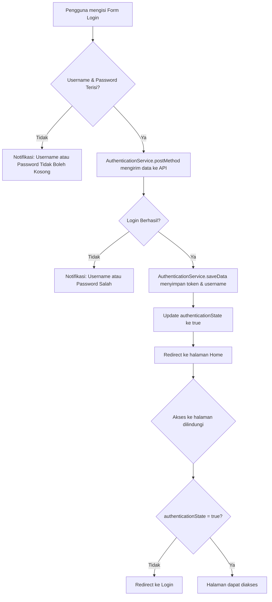

### Penjelasan Detail Proses Login

#### Flowchart Login

Berikut adalah flowchart proses login dari mulai input pengguna hingga akses ke halaman yang dilindungi:




Pada aplikasi ini, proses login menghubungkan pengguna dengan API untuk verifikasi akun dan menyimpan status autentikasi secara lokal. Berikut langkah-langkah rinci proses login yang terjadi dalam kode:

1. **Deklarasi HTTP Client**: Pada file `app.module.ts`, HTTP Client diaktifkan untuk berinteraksi dengan API, memungkinkan pengiriman permintaan autentikasi.
   ```typescript
   providers: [{ provide: RouteReuseStrategy, useClass: IonicRouteStrategy }, provideHttpClient()],
   ```

2. **Form Login**: Di `login.page.html`, terdapat form login dengan input untuk `username` dan `password` serta tombol "Login". Pengguna mengisi form ini untuk memulai proses autentikasi.
   ```html
   <ion-input type="text" [(ngModel)]="username" required="required"></ion-input>
   <ion-input type="password" [(ngModel)]="password" required="required"></ion-input>
   ```

3. **Pengiriman Data Login**: Ketika tombol login ditekan, fungsi `login()` di `login.page.ts` akan dipanggil. Fungsi ini memeriksa apakah `username` dan `password` tidak kosong, kemudian mengirimkan data tersebut ke API melalui metode `postMethod()` dari `AuthenticationService`.
   ```typescript
   login() {
       if (this.username && this.password) {
           const data = { username: this.username, password: this.password };
           this.authService.postMethod(data, 'login.php').subscribe({
               next: (res) => {
                   if (res.status_login == "berhasil") {
                       this.authService.saveData(res.token, res.username);
                       this.router.navigateByUrl('/home');
                   } else {
                       this.authService.notifikasi('Username atau Password Salah');
                   }
               },
               error: () => this.authService.notifikasi('Login Gagal Periksa Koneksi Internet Anda')
           });
       } else {
           this.authService.notifikasi('Username atau Password Tidak Boleh Kosong');
       }
   }
   ```

4. **Penyimpanan Token Autentikasi**: Jika API mengembalikan respons sukses (`status_login == "berhasil"`), maka token dan username disimpan melalui `saveData()` di `AuthenticationService`. Data ini disimpan menggunakan `Preferences` untuk digunakan dalam sesi berikutnya.
   ```typescript
   saveData(token: string, user: any) {
       Preferences.set({ key: TOKEN_KEY, value: token });
       Preferences.set({ key: USER_KEY, value: user });
       this.isAuthenticated.next(true); // Menandakan pengguna telah terautentikasi
   }
   ```

5. **Redirection ke Halaman Home**: Setelah berhasil login, pengguna diarahkan ke halaman **home** (`/home`), yang hanya dapat diakses ketika `isAuthenticated` bernilai `true`.

6. **Proteksi Halaman dengan Guard**: Guard `authGuard` memastikan bahwa pengguna yang mengakses halaman **home** harus dalam status terautentikasi. Jika pengguna belum login, mereka akan diarahkan kembali ke halaman login (`/login`).
   ```typescript
   return authService.authenticationState.pipe(
       filter((val) => val !== null),
       take(1),
       map((isAuthenticated) => {
           if (isAuthenticated) {
               return true;
           } else {
               router.navigateByUrl('/login', { replaceUrl: true });
               return false;
           }
       })
   );
   ```
